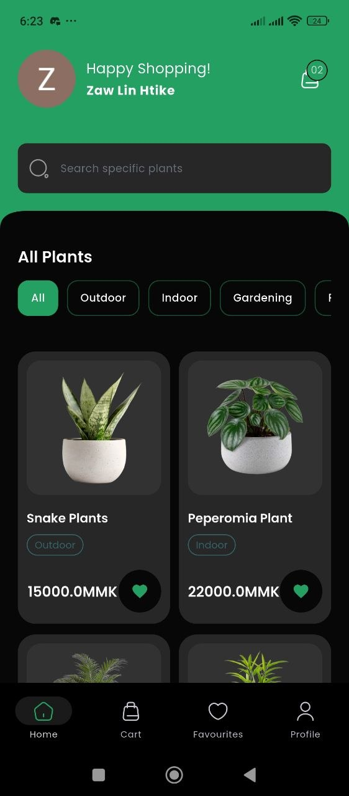
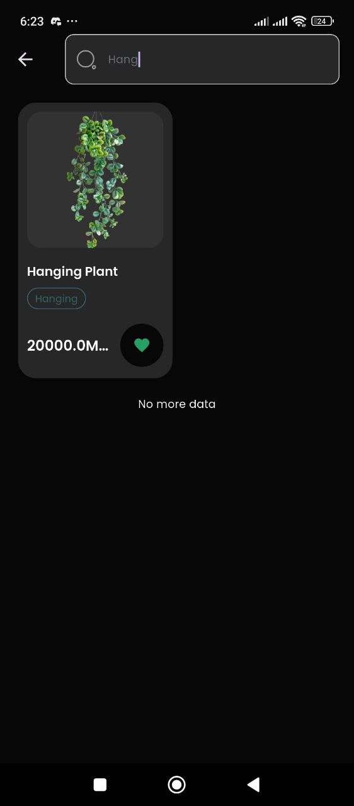
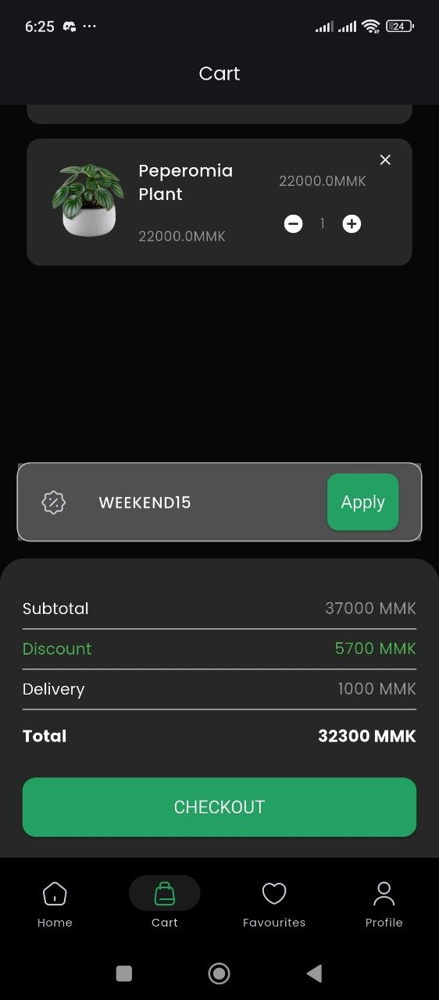
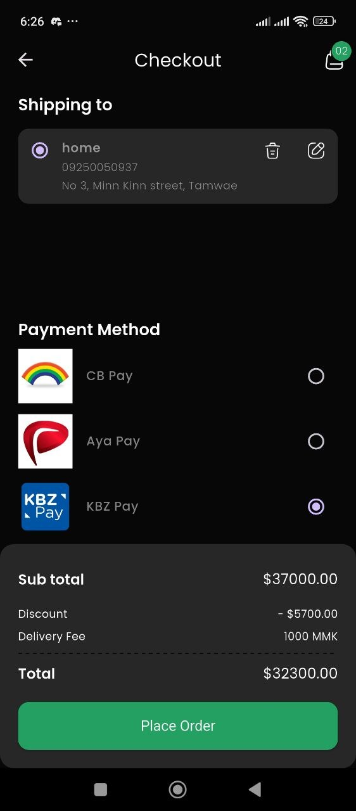
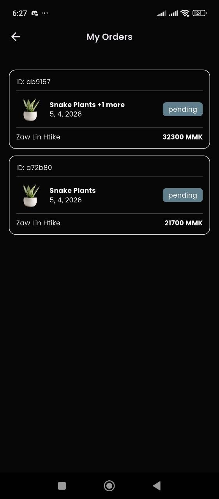
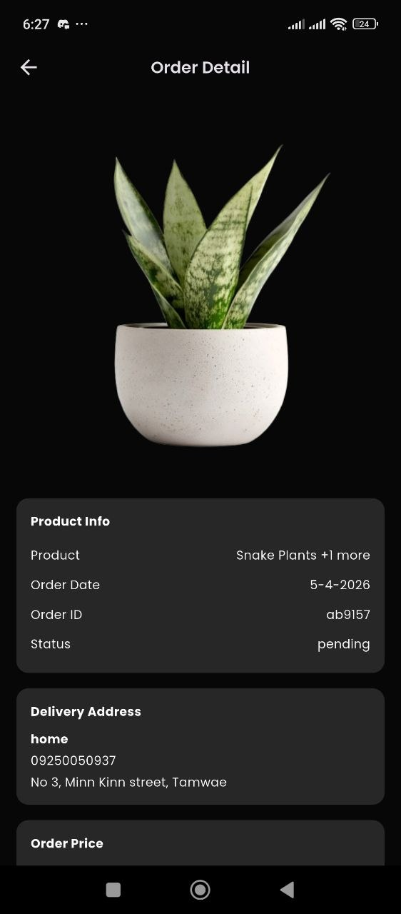

# 🌿 Plantify – Plant Shop E-commerce App

Plantify is a modern and user-friendly plant shop e-commerce mobile application built with Flutter. This project follows featured-first folder structure along with some prinicples of clean architecture. User can browse plants, add plants to wishlist, add plants to cart, perform checkout (not include real-world payment integration) and see order history. Below is my built apk file.

🔗 **Built APK version of app:** https://github.com/Zawlinhtike397/plantshop_ecommerce_app/releases/tag/v1.0.0

## 📸 Screenshots (Test with dark theme)

<p align="center">
  
  
  
</p>

<p align="center">
  
  
  
</p>

## 📌 Purpose

The purpose of this project is to demonstrate:
- Scalable Flutter app architecture  
- Clean state management using BLoC  
- Backend integration with Supabase  
- Local storage handling  
- Real-world e-commerce features implementation  

## 🚀 Getting Started/Installation
```
git clone https://github.com/Zawlinhtike397/plantshop_ecommerce_app.git
cd plantshop_ecommerce_app
code .
flutter pub get
flutter run
```

## 🚀 Tech Stack

- **Flutter** – Cross-platform mobile development  
- **BLoC (Business Logic Component)** – State management  
- **Supabase** – Backend (Authentication, Database, APIs)  
- **Hive (Hive CE)** – Lightweight local database  
- **SharedPreferences** – Simple key-value local storage  

## ✨ Key Features

### 🧭 Onboarding
- Intro screens for new users  

### 👤 Authentication
- Register new account  
- Login (Email & Google)  
- Email verification system  
- Password reset via deep linking  

### 🛒 Shopping Experience
- Browse and filter plants
- search specific plants  
- Add to cart (stored locally using Hive)  
- Mark items as favorites ❤️  
- Apply discount coupons 🎟️  

### 💳 Checkout System
- Select delivery address  
- Choose payment method (currently just UI)  
- Complete order flow  

### 📦 Orders
- Fetch and display user orders  
- Order history screen  

### ⚙️ Profile Management
- Edit user profile  
- Manage personal details  

### 🎨 Theme and UX
- Shimmer loading effects for better UX  
- Use your phone theme (Change your phone theme to toggle dark mode)
- lazy loading and inifite scroll with show more button

### 📱 Local Storage Usage

- **Hive** → Storing cart data 
- **SharedPreferences** → Storing user session & small data  

## 🔩 Future Improvements
- Due to budget limitation, supabase default mail handler is used instead of custom SMTP server which has mail rate limit of 2 mails per hour. (will improve in future).
- Due to nature of supbase auth, if user is already login with google, he can't perform register a new account using same email. Instead,he should use google login. (will improve in future).
